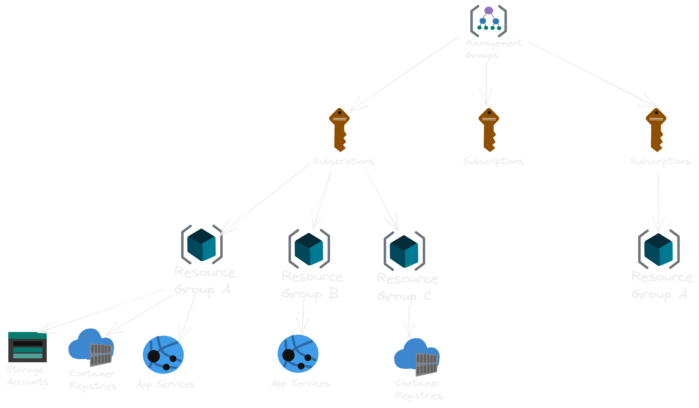

# Resouce Group

Todos os recursos no Azure esta dentro de um resouce group, ele é a forma de organizar virtualmente seus serviçoes, ajudando analisar valores gastos, controlando acessos e outras facilidade. Podem servir para organizar de várias formas, por time, projeto, empresa, tipo de serviço...

